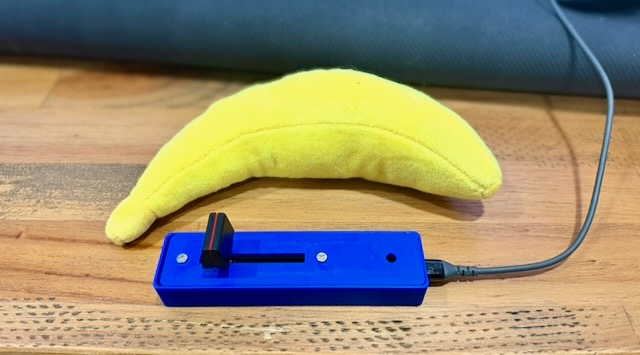

# USB MIDI Crossfader

I wanted a simple MIDI crossfader for using with Traktor and Ableton.  I couldn't find anything I liked so decided to build my own.  The Mini Innofader Plus I used is way overkill, you could swap it out with something cheaper. It should work just fine with the Teensy code as is, you'd just need to tweak the case to fit whatever you buy.  You'll need some basic soldering tools and skills, and a 3d printer to complete this project.

## Materials

To build this you'll need to buy
Mini Innofader Plus ($115 shipped) [innofader.com](https://www.innofader.com/products.php?id=24)

Teensy 4.0 (without pins) ~$23 [sparkfun.com](https://www.sparkfun.com/teensy-4-0.html) |

Optional:
WS2812B NeoPixel LED (single)
Adhesive rubber feet

## Wiring

The Mini Innofader Plus includes multiple harnesses.  I used one of the 3-wire harnesses (gray, green, blue). The fader has
auto-sensing polarity, so the outer two wires (VCC/GND) can be swapped without damage.
The center wire (green) is always the wiper/signal.

| Wire | Color | Teensy 4.0 Pin |
|------|-------|---------------|
| VCC | Gray | 3.3V |
| Wiper (signal) | Green (center) | A0 (pin 14) |
| GND | Blue | GND |

**WS2812B LED** (optional):

| LED Wire | Teensy 4.0 Pin |
|----------|---------------|
| GND | GND |
| DIN (data in) | Pin 2 |
| VCC | 3.3V |

## Firmware

### Requirements

- [Arduino IDE](https://www.arduino.cc/en/software)
- [Teensyduino](https://www.pjrc.com/teensy/td_download.html) add-on — follow the install guide on the Teensyduino page for your platform
- [Adafruit NeoPixel](https://github.com/adafruit/Adafruit_NeoPixel) library — Arduino IDE may prompt to install this automatically when you open the sketch; otherwise install via **Sketch > Include Library > Manage Libraries**
### Flashing

1. Open `firmware/crossfader.ino` in Arduino IDE
2. Select **Board: Teensy 4.0**
3. Select **USB Type: Serial + MIDI**
4. Click Upload

### Configuration (via Serial)

Settings can be changed in code before uploading, or can be changed over serial and saved to EEPROM (persists across power cycles).
Open any serial terminal at 9600 baud — Arduino Serial Monitor works fine.

When connected, the device prints its current config automatically.

| Command | Description |
|---------|-------------|
| `channel <1-16>` | Set MIDI channel |
| `cc <0-127>` | Set fader CC number |
| `ledcc <0-127>` | Set incoming CC number for LED color |
| `status` | Print current config |

## Testing

Once the firmware is flashed and the fader is wired up, you can validate that everything
works before connecting to your software.

### MIDI Monitor

[MIDI Monitor](https://www.snoize.com/midimonitor/) is a free macOS app that displays
all incoming MIDI messages in real time.  You should be able to use something like MidiView for PC.

1. Install and open MIDI Monitor
2. Plug in the Teensy via USB — it should appear as a MIDI source named "Teensy MIDI"
3. Select the source in MIDI Monitor's sources list
4. Move the fader — you should see **Control Change** messages scrolling as you move it
5. The CC number and channel should match your configured values (defaults: CC 4, channel 20)
6. Values should range smoothly from 0 (one end) to 127 (other end)

### Troubleshooting

- **No MIDI device appears** — make sure the firmware was flashed with **USB Type: Serial + MIDI**. If you used a different USB type, reflash with the correct setting.
- **Device appears but no messages** — check the wiring. The signal wire (green/center) must be connected to **A0**. Verify VCC and GND are connected to **3.3V** and **GND**.
- **Values jump or are noisy** — this can indicate a loose solder joint on the wiper (signal) wire. Reflow the connection.
- **Values only go partway** — the fader travel may not reach the full range. This is normal for some innofader models and can be adjusted in the firmware's ADC mapping if needed.
- **Teensy not recognized by macOS** — try a different USB cable (some cables are charge-only with no data lines). Try a different USB port.

## Enclosure

Open `enclosure/crossfader_case.scad` in [OpenSCAD](https://openscad.org/) to render and export STL files.

The enclosure is a two-piece design:

- **Base** — full-height box with internal support for the lid, USB port cutout, and a friction-fit Teensy cradle with L-shaped rails and SMD clearance underneath
- **Lid** — hollow shell with fader slot, M3 mounting holes, and optional LED hole; drops into the base

All dimensions are parametric — adjust fader and Teensy measurements at the top of the SCAD file to fit your specific components.

### Print Settings

- Layer height: 0.2mm
- Infill: 20%
- Material: PLA or PETG
- Supports: none needed (both pieces print flat)

**Bambu Studio note:** After importing the STL, split the parts and flip the lid 180 degrees so the top surface sits flat on the build plate. The SCAD file exports both pieces upright, but the lid needs to print top-down.

## RGB LED (Optional)

The LED lights red on power-up. Software (e.g., Traktor) can change the color by sending
a MIDI CC message back to the device on the configured LED CC number (default: CC 2).

| CC Value | Color |
|----------|-------|
| 0-15 | Red |
| 16-31 | Green |
| 32-47 | Blue |
| 48-63 | Yellow |
| 64-79 | Cyan |
| 80-95 | Magenta |
| 96-111 | White |
| 112-127 | Off |